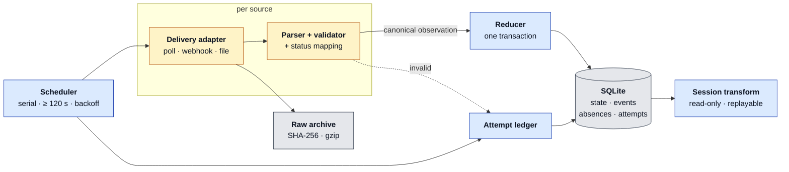

# Architecture

One synchronous Python process plus SQLite, standard library only. The split that matters is not
*collector vs. analyzer* — it is **generic core vs. per-source edge**.

Blue = generic, written once. Amber = the only code written per feed. Grey = storage.

The tuple crossing the amber→blue boundary is
`(source, location_id, evse_uid, evse_id, status, source_last_updated)`. Everything downstream of
the parser knows only that tuple, which is why a new feed costs an adapter, not a pipeline. Network
I/O and parsing run **outside** the write transaction, and every attempt ends as exactly one ledger
row: one classifier (`collector._describe_failure`) maps rate limits, HTTP errors, network faults,
unparseable bodies and internal bugs onto the same persistence path.

## Invariants the code enforces

- File locks on endpoint and database admit **one** collector, **one** request in flight.
- Request **starts** are ≥ 120 s apart, across restarts too — cadence is re-derived from the
  persisted ledger, not process memory.
- First sight of an EVSE is a **baseline**, never a change. Only a differing status **value** makes
  one; a moving `last_updated` does not.
- Absence is not a status: a missing EVSE writes an audit row, never a fabricated transition.
- A failed or invalid snapshot leaves state untouched. A committed snapshot is all-or-nothing.
- Sessions derive from immutable events, so the rules can change without re-collecting.

## Generic vs. per source

| Generic across all sources | Written per source |
|---|---|
| Scheduling, attempt ledger, backoff, failure classification, logs | Delivery adapter: poll, webhook, or file reader |
| Raw hashing and archive contract | Format parsing and schema validation |
| Canonical EVSE observation and transactional reducer | External identity and status vocabulary mapping |
| Event and session transforms, quality metrics | Full-vs-partial snapshot rule, timestamp trust rule |

## Scaling to 100+ sources

Keep those boundaries and add a **source registry** holding adapter, cadence, timeout, and
rate-limit config. Source workers then run concurrently, with a per-source lease preserving serial
execution *within* a source. Push and file adapters land immutable payloads and re-enter the same
normalize → reduce path, so a webhook source costs an adapter, not a second pipeline.

**First infrastructure change:** PostgreSQL, for concurrent writers, operational queries and
database-backed leases; object storage for raw payloads. A queue comes only when push bursts, retry
isolation or independent scaling demand it — not because there are 100 sources. Before a bigger
scheduler: schema contracts, replay tests, per-source freshness and error SLOs, and a quarantine for
bad payloads.

## Throughput is not the constraint

A synthetic 30,000-EVSE snapshot (10.2× the live feed) parses and reduces in **273–284 ms p95**
across three consecutive runs — **0.23 %** of the 120 s interval, roughly 108,000 EVSEs/s. In the
live run the *fetch* took 21.4 s on average (3.76 MB, served uncompressed) against 48 ms of local
parse + persist. The source owns the latency budget, not the pipeline.

The hard production problems are semantic: stable identity across redeploys, heterogeneous status
meaning, partial snapshots, source timestamp quality, and transitions that happen entirely between
two polls.
