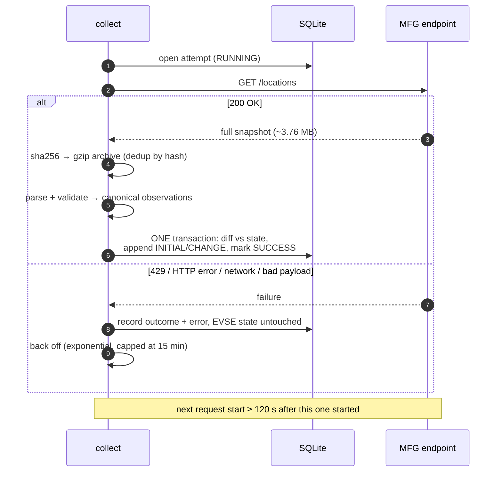

# ChargeViz — EVSE status pipeline

Polls Motor Fuel Group's full location snapshot politely, records real EVSE status transitions in
SQLite, and reconstructs completed `CHARGING` episodes from them. Restart-safe. Runtime code uses
**only the Python standard library** — the single optional dependency, `rich`, does nothing but
draw nicer tables.

**Result of the shipped run: average session duration 26.54 min over 519 complete episodes.**
Method, censoring and caveats: [`RESULTS.md`](RESULTS.md).

## Run it

Prerequisite: Python 3.11+.

```bash
python3 -m venv .venv
source .venv/bin/activate                 # Windows: .venv\Scripts\activate
python -m pip install .

chargeviz collect --duration 2h --interval 120 \
  --db data/reviewer.sqlite3 --archive-dir data/reviewer-raw
```

The first request fires immediately; every later request **start** is at least 120 s after the
previous one, including across restarts. `Ctrl-C` is safe — committed snapshots stay valid, an
interrupted attempt stays visible as `RUNNING`, and re-running the command resumes from persisted
state. Each poll prints one line of JSON metrics.

## Read the result

```bash
chargeviz report --db data/chargeviz.sqlite3                    # sectioned tables (default)
chargeviz report --db data/chargeviz.sqlite3 --format markdown  # paste into a document
chargeviz report --db data/chargeviz.sqlite3 --format json      # for machines
```

The default `text` format prints aligned tables using the standard library alone. Install the
optional extra for boxed, coloured output:

```bash
python -m pip install ".[pretty]"
```

That pulls in `rich` and nothing else. Without it the same report renders as plain text, and
`--output` always writes plain text so a file never receives escape codes.

The 2-hour run's database is committed, so every figure in `RESULTS.md` is recomputable without
touching the network. `data/raw/` (compressed response bodies) is deliberately not in Git.

## What one poll does



## Operational behaviour

- A non-2xx response, timeout, malformed or empty JSON, or a conflicting duplicate **never** mutates
  EVSE state. Snapshot application is all-or-nothing.
- Every attempt — successful or not — lands exactly one row in the poll ledger, so a restart can
  re-derive the cadence from disk instead of trusting process memory.
- `429 Retry-After` is stored separately and **never shortens** the enforced 120 s minimum. Repeated
  failures back off exponentially up to 15 minutes.
- Status **values** create events — a moving `last_updated` alone does not. A missing EVSE writes an
  audit row, not a fabricated status.
- Both source `last_updated` and poll observation time are kept. All stored times are UTC.
- OS locks on the database *and* the endpoint reject a second concurrent collector.
- Response bodies capped at 64 MiB compressed and decompressed; HTTP timeout 30 s.
- Successful bodies are gzipped under their SHA-256 name, so identical snapshots occupy one file.

## Verify

Everything except the collection run, in one line from a fresh clone:

```bash
python3 -m venv .venv && source .venv/bin/activate && pip install -q ".[dev,pretty]" && pytest -q && ruff check . && ruff format --check . && chargeviz report --db data/chargeviz.sqlite3 && python -m chargeviz.benchmark --evses 30000 --iterations 5
```

That is 68 tests (~3 s), the lint and format checks, every `RESULTS.md` figure recomputed from the
committed database, and the 30,000-EVSE benchmark. No network access at any point.

Tests use local fixtures, a local HTTP server, a fake clock and temporary databases — **no calls to
the public endpoint**. They cover full-snapshot validation, duplicate conflicts, idempotency, atomic
rollback, restart cadence, 429 handling, gzip transport, missing EVSEs and session censoring.

## Documents

| File | Content |
|---|---|
| [`ARCHITECTURE.md`](ARCHITECTURE.md) | Design, invariants, and the path to 100+ sources |
| [`RESULTS.md`](RESULTS.md) | The number, the session rules, business stakes, and limits |
| [`GLOSSAIRE.md`](GLOSSAIRE.md) | Glossaire FR des termes techniques et métier |
| [`AI_USAGE.md`](AI_USAGE.md) | How AI tools were used, and where they were wrong |
