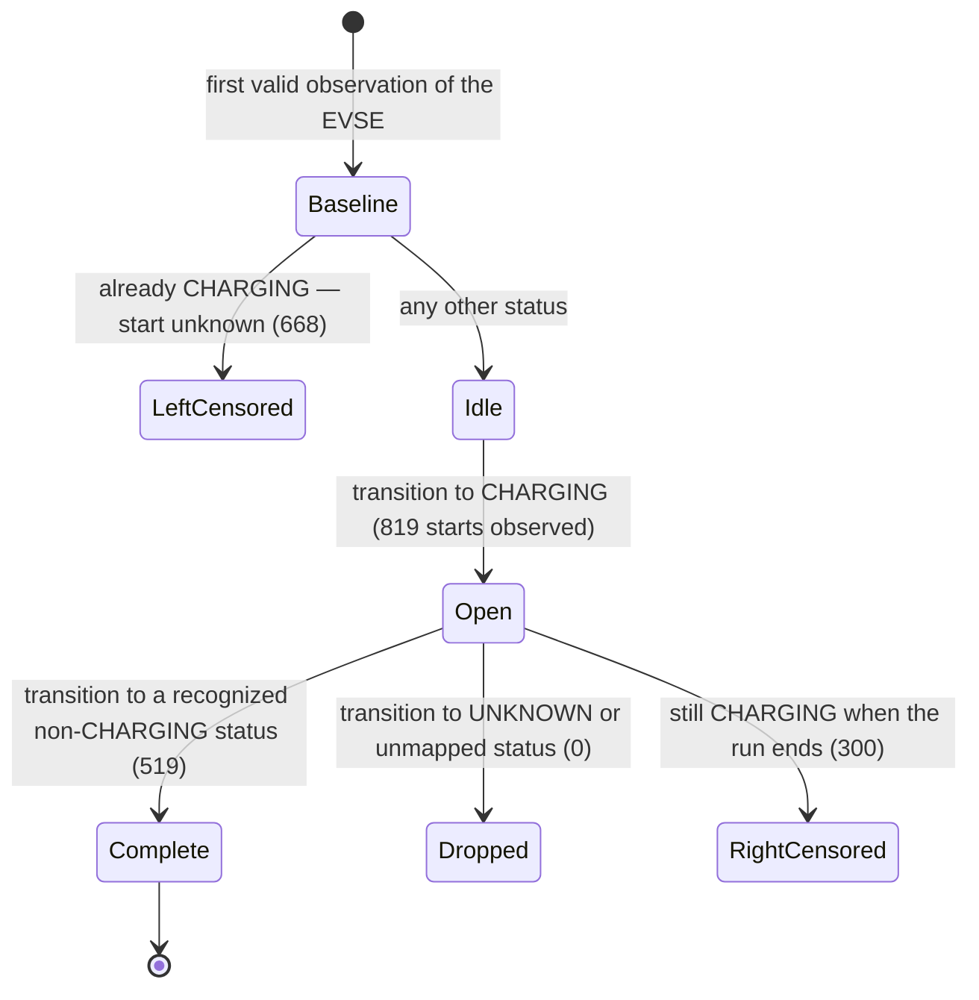

# Results

## The number

> **Average session duration: 26.54 minutes**, over **519 complete `CHARGING` episodes**,
> observed on the Motor Fuel Group feed between **2026-07-27 17:17 and 19:16 UTC**
> (Monday, 18:17–20:16 UK local time).

| | |
|---|---:|
| Mean | **26.54 min** |
| Median | 23.98 min |
| P90 (nearest rank) | 51.43 min |
| Min / Max | 0.33 min / 98.54 min |
| Complete sessions (the denominator) | **519** |
| Left-censored (already charging at first sight) | 668 |
| Right-censored (started, still charging at cutoff) | 300 |
| EVSEs tracked / locations | 2 944 / 583 |
| Status changes recorded | 2 294 |

Every figure here comes back out of the committed database:

```bash
chargeviz report --db data/chargeviz.sqlite3
```

---

## Why anyone cares about this number in Europe

This feed exists because the law says it has to. The UK Public Charge Point Regulations oblige
operators like MFG to publish open data on charge point availability, and to keep their rapid
charging networks at 99 % reliability. Across the Channel, AFIR pushes the same idea onto the EU:
operators have to make dynamic availability data reachable through national access points. So the
JSON I polled for two hours is not a courtesy. It is a compliance artefact, and it is the raw
material anyone gets when they try to answer the question everybody is asking right now — *is
Europe's charging infrastructure actually working?*

That question has real money behind it. The continent has somewhere around a million public
charge points today and needs several million by 2030 to match the vehicle fleet that policy is
steering into existence. Every one of those points is a capital decision made by someone who wants
evidence. Utilisation is the evidence they usually ask for, and average session duration is the
metric they usually reach for first.

It is a worse metric than it looks. Three things I would say out loud before anyone put 26.54
minutes in a deck.

**The denominator is not a random sample.** The run touched 1 487 episodes and only 519 of them
have both a beginning and an end inside the window — 34.9 %. The 668 left-censored episodes are not
an artefact of the code: they are the 22.7 % of the fleet that was already charging at the first
poll, which is the same 22.7 % that appears as peak occupancy in the table below. You cannot know
when those sessions started, and no amount of polling after the fact recovers it. A long session is structurally more
likely to be cut off by the two-hour boundary and dropped, which drags the mean down. An episode
that opens and closes between two polls is never seen at all, which pushes it up. I cannot measure
either effect from a two-hour run, so I am not going to claim the bias points one way. What I can
say is that it is not small, which is why the censored counts are in the table above rather than
quietly excluded.

**There is a better metric sitting in the same data.** Point-in-time occupancy — the share of EVSEs
reading `CHARGING` at each poll — needs no session reconstruction and no assumption about
completeness. It cannot be censored, because it never spans time.

| Occupancy across the 54 successful polls | |
|---|---:|
| Mean | **21.1 %** of 2 944 EVSEs |
| Range | 20.2 % – 22.7 % |
| Also `INOPERATIVE` at cutoff | 12.8 % (377 EVSEs) |

Occupancy held inside a 2.5-point band across all 54 polls. It is the number I would lead with.

And it surfaces something the session mean hides completely: **roughly one EVSE in eight was
advertising itself as inoperative.** Against a 99 % reliability obligation, that is the finding on
this page. It is a fleet-availability problem, not a utilisation one, and it is the more urgent of
the two — a charge point that is down earns nothing, fails the driver who planned around it, and
counts against the operator's regulatory position. I would not read 12.8 % as a compliance breach
on its own; the regulation is written around rapid-charge networks measured annually, this snapshot
covers every EVSE MFG publishes over two hours, and status semantics vary. But it is exactly the
shape of signal a data platform should be raising, and it is invisible if you only report dwell
time.

**"In use" is an advertised status, not a delivered service.** This pipeline reads what the
operator publishes. An EVSE flagged `CHARGING` might be mid-session, finished but still plugged in,
or simply reporting stale state. Nothing here is reconciled against a meter, a CDR, or a payment.
No kWh, no revenue, no driver.

Who would actually use it, and for what:

| Who asks | What they decide | What 26.54 min is worth to them |
|---|---|---|
| **Charge point operator** | Where to add hardware, how to price, when to send an engineer | Useful as a dwell-time input for queueing; useless for revenue |
| **Investor / asset owner** | Site-level yield, acquisition price | Weak. Yield tracks energy delivered and occupancy, not flagged-busy time |
| **Public authority** | Grid planning, subsidy targeting, coverage obligations | A reasonable proxy for connector turnover, but needs a full day and several operators |

---

## Session definition

There is no official definition in this data, so here is mine, stated as rules.

The entity is **`(source, location_id, evse_uid)`** — not the connector. OCPI defines an EVSE as
able to serve one vehicle at a time, so two connectors on one EVSE are not two sessions.



Only the **Complete** branch reaches the mean. The other three are counted and published, never
guessed.

1. The **first** valid observation of an EVSE is a baseline, never a transition. An EVSE already
   `CHARGING` is **left-censored** and excluded — its start is unknowable.
2. A transition from any non-`CHARGING` status **to** `CHARGING` opens a candidate episode.
3. The **first** later transition to a recognized OCPI status other than `CHARGING` or `UNKNOWN`
   closes it. **No duration filter is applied** — a 20-second episode counts.
4. `UNKNOWN` and unmapped vendor statuses are ambiguous, so the episode is **dropped**, not
   asserted to have ended cleanly. (In this run: 0 dropped.)
5. Episodes still open at cutoff are **right-censored**. An episode already charging at baseline
   stays left-censored even if it is also open at cutoff — no double counting.
6. Failed polls, missing EVSE rows, or a start-to-start pause over 1.5× cadence create a **gap**,
   never a synthetic end.

**Timestamp rule.** A source `last_updated` is trusted as a session boundary only when
`previous_observed_at < last_updated ≤ observed_at` at *both* ends, with a positive resulting
duration. Otherwise both boundaries fall back to poll observation time, and the fallback is counted.
Here **2 of 519** sessions needed the fallback, and the all-observation-time mean is **26.51 min** —
1.9 seconds from the headline. The two clocks agree, which is worth knowing: the result does not
depend on trusting the operator's timestamps.

Status **values** are what create events. OCPI `last_updated` also moves for connector metadata, so
on its own it is not evidence of a status transition.

---

## The distribution behind the mean

The mean sits in the valley between two clusters, which is the clearest argument against quoting it
alone:

| Duration | Sessions | Share | |
|---|---:|---:|---|
| < 5 min | 75 | 14.5 % | `████████` |
| 5 – 10 min | 44 | 8.5 % | `████` |
| 10 – 15 min | 47 | 9.1 % | `█████` |
| 15 – 20 min | 43 | 8.3 % | `████` |
| 20 – 30 min | 120 | 23.1 % | `████████████` |
| 30 – 45 min | 110 | 21.2 % | `███████████` |
| 45 – 60 min | 50 | 9.6 % | `█████` |
| ≥ 60 min | 30 | 5.8 % | `███` |

Two populations. A short tail under five minutes (14.5 %, plausibly aborted or failed plug-ins) and
a broad 20–45 minute mass (44.3 %, consistent with rapid-charge top-ups on a motorway-services
estate). Median 23.98 min and P90 51.43 min carry more information than the mean does.

How episodes ended is just as informative:

| Terminal status | Count | Share |
|---|---:|---:|
| `AVAILABLE` | 454 | 87.5 % |
| `INOPERATIVE` | 62 | 11.9 % |
| `OUTOFORDER` | 3 | 0.6 % |

**One in eight complete episodes ends in a fault status rather than a clean release.** Those 65
episodes stay in the headline mean, because they are genuine ends of an advertised charging state.
They are not "a driver finished charging and drove away", and a serious availability product would
split them out.

**Consistency check.** 819 starts observed = 519 complete + 300 right-censored. 887 ends observed =
519 matched + 368 closing left-censored episodes. 600 EVSEs `CHARGING` at cutoff = 300
right-censored + 300 left-censored still open. The ledger balances.

---

## Run quality

58 attempts, 54 successful, 4 rate-limited (HTTP 429), 0 other failures, 0 left incomplete. Median
start-to-start gap 120.006 s. The recorded minimum is 119.993 s: the 120 s floor is enforced on a
**monotonic** clock, and that 7 ms shortfall is drift between the monotonic and wall clocks in the
stored timestamps, not a request that went out early.

| Window | Polls | Span | Interrupted by |
|---|---|---|---|
| 17:17 → 17:23 | 1–4 | 6 min | 429 at 17:25 and 17:27 |
| 17:29 → 17:35 | 7–10 | 6 min | **no attempt 17:35 → 17:42 (6 min 43 s)** |
| 17:42 → 18:02 | 11–21 | 20 min | 429 at 18:04 |
| 18:06 → 18:52 | 23–46 | **46 min** | 429 at 18:54 |
| 18:56 → 19:16 | 48–58 | 20 min | end of run |

The four 429s behaved exactly as designed: the attempt was recorded with its `Retry-After` (8, 29,
22 and 20 s), EVSE state was left untouched, and the next request still respected the 120 s minimum
rather than the shorter hint the server offered. Being allowed back sooner is not a reason to go
back sooner.

The 6 min 43 s hole is more honest than that. It has **no attempt row at all**, which means the
collector process was not running — my machine, not the endpoint. Poll 10 completed cleanly at
17:35:38 and poll 11 started at 17:42:00, and *no* attempt was left in `RUNNING`, so the process
stopped during the wait rather than mid-request: nothing was half-written. (A poll killed during
its fetch would have left a `RUNNING` row with a start time and no completion — that is what the
status is for.) On restart the collector re-derived its cadence from the persisted ledger and the
120 s floor held across the boundary. I left the gap in rather than re-running for a
cleaner-looking dataset.

Per-poll cost: fetch 21.4 s mean (p95 22.5 s) for a 3.76 MB uncompressed body, parse 31.5 ms
median, persist 16.2 ms median. The endpoint owns 99.8 % of the wall time.

### Why the gap-free figure is lower — and is *not* the cleaner estimate

362 of the 519 complete sessions span a 429 or the process gap. The other 157 average **11.82 min**
against 26.54.

That gap is an artefact, not a correction. A session counts as gap-free only if it starts *and* ends
inside one uninterrupted window, and the longest such window was 46 minutes. The longest gap-free
session observed is 40.9 minutes, against 98.5 overall. The filter mechanically truncates the
distribution. **The gap-free mean is a short-session estimate, not a clean one.** It belongs here as
a sensitivity bound; the headline correctly keeps gap-spanning sessions, because a 429 does not
invalidate a transition observed both before and after it.

---

## What this does not measure

- **No energy, no money, no driver.** No kWh, power, tariff, authorization, customer or CDR data.
  This is not a billing session and cannot be reconciled with one.
- **Blind between polls.** A two-minute cadence cannot see an episode that opens and closes inside
  one interval, and it quantises observation-time durations to ±2 minutes.
- **One operator, one evening, one day.** MFG only, over a two-hour weekday evening window on a
  motorway-services estate. That is a convenience sample, not a utilisation benchmark for anything,
  and an evening is very likely atypical.
- **Advertised state, unverified.** Stale `last_updated`, `UNKNOWN` (40 EVSEs at cutoff), and
  abnormal terminal statuses all need an explicit policy before any business use.

Status semantics follow the
[OCPI 2.2.1 Locations module](https://github.com/ocpi/ocpi/blob/release-2.2.1-bugfixes/mod_locations.asciidoc).
The feed is treated as OCPI-*style*, not assumed fully compliant.

---

## Reproduce

```bash
chargeviz report --db data/chargeviz.sqlite3
chargeviz report --db data/chargeviz.sqlite3 --format json
```

The database is committed, so every number above is recomputable without touching the network.
Session rules live in [`src/chargeviz/sessions.py`](src/chargeviz/sessions.py) and read immutable
events, so changing a rule changes the report without re-collecting anything.

Benchmark environment: Apple Silicon macOS, Python 3.11, stdlib SQLite. The 30,000-EVSE
microbenchmark quoted in [`ARCHITECTURE.md`](ARCHITECTURE.md) measures local headroom only and says
nothing about multi-source network reliability. French glossary of the technical and business terms
used here: [`GLOSSAIRE.md`](GLOSSAIRE.md).
